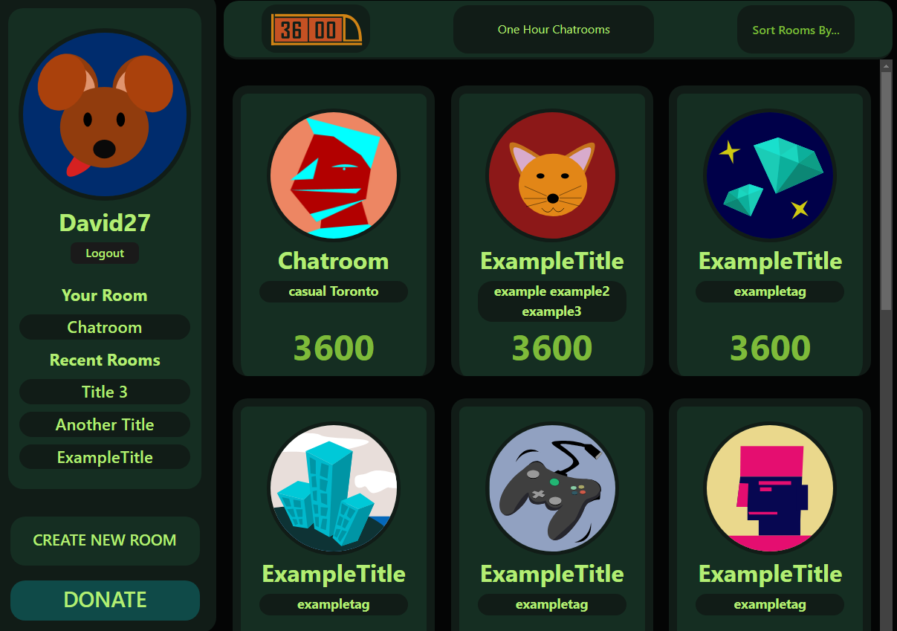
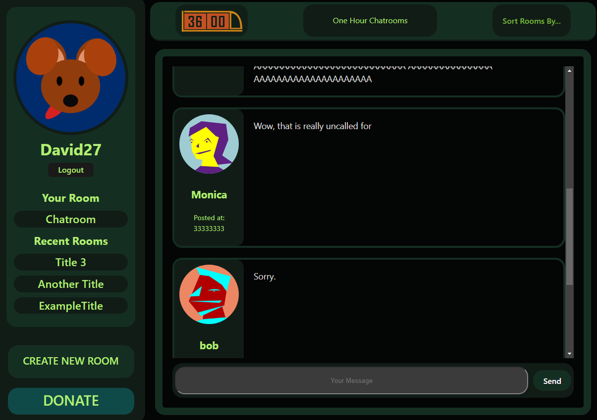
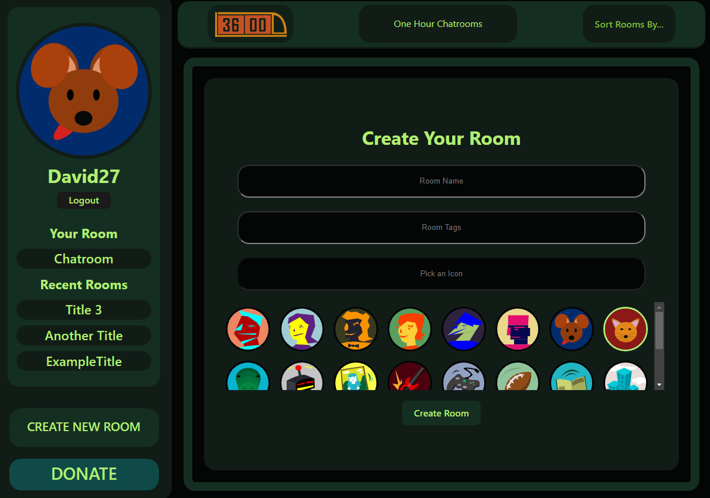

# 3600 - The Ephemeral Chatroom App

## Table of Contents
- [Description](#description)
- [Key Features](#key-features)
- [Tech Stack](#tech-stack)
- [Getting Started](#getting-started)
- [Examples](#examples)
- [Feedback and Support](#feedback-and-support)
- [Contributors](#contributors)
- [License](#license)

## Description

Introducing 3600, the revolutionary anti-social media platform that redefines online communication. In 3600, users can create chatrooms on any topic, but with a unique twist: each chatroom exists for only one hour before vanishing forever. This fleeting nature encourages genuine, in-the-moment conversations, free from the permanence and pressure of traditional social media. It's the perfect space for meaningful interactions where your words live for a moment, not a lifetime. Join 3600, and experience the freedom of temporary connections in a digital world.

## Key Features

- **Temporary Chatrooms:** Chatrooms automatically vanish after 60 minutes, promoting real-time, in-the-moment conversations.
  
- **No Permanent Record:** Forget the pressure of creating a lasting impression. Conversations disappear, allowing users to express themselves freely.

- **Diverse Topics:** Create or join chatrooms on a wide range of topics, from casual discussions to serious debates.

- **Anonymous or Authenticated:** Choose to chat anonymously or authenticate your identity for a personalized experience.

- **Freedom of Expression:** Share your thoughts without the fear of long-term consequences. 3600 fosters a space for honest and spontaneous conversations.

## Tech Stack

3600 leverages a robust tech stack to provide a seamless user experience:

- **React:** A JavaScript library for building user interfaces.
- **Vite:** A fast, opinionated web dev build tool that serves as a Next-Generation Frontend Tooling.
- **MongoDB:** A NoSQL database for storing chatroom data, ensuring scalability and flexibility.
- **Apollo Server:** A GraphQL server that facilitates efficient communication between the client and MongoDB.
- **GraphQL:** A query language for APIs that enables precise data retrieval, enhancing app performance.

## Getting Started

1. **Sign Up or Log In:** Create an account or log in to get started. Choose between anonymous or authenticated profiles.

2. **Create a Chatroom:** Start a chatroom on any topic you like. Set the timer for 60 minutes, and watch the conversation unfold.

3. **Join Existing Chatrooms:** Explore a variety of ongoing chatrooms created by other users. Jump in and engage in lively discussions.

4. **Watch the Clock:** Keep an eye on the timer. Once 60 minutes pass, the chatroom disappears, leaving no trace behind.

5. **Enjoy Temporary Connections:** Experience the freedom of temporary connections, where conversations are ephemeral and spontaneous.

## Examples

## Feedback and Support

We welcome your feedback and suggestions. If you encounter any issues or have ideas to improve 3600, please reach out to our support team at [support@3600app.com](mailto:support@3600app.com).

## Contributors

- **Randy:** Add your roles here.
  
- **Angelica:** Add your roles here.

- **Steven:** Add your roles here.

- **Matthew:** Add your roles here.

## License

This project is licensed under the [GNU General Public License v3.0](https://opensource.org/licenses/GPL-3.0).

**Experience the magic of fleeting conversations with 3600 - Where Words Last for a Moment, Not a Lifetime.**
